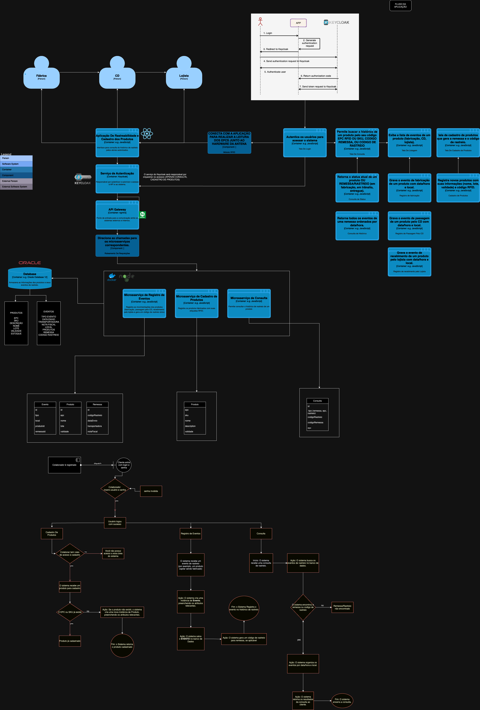
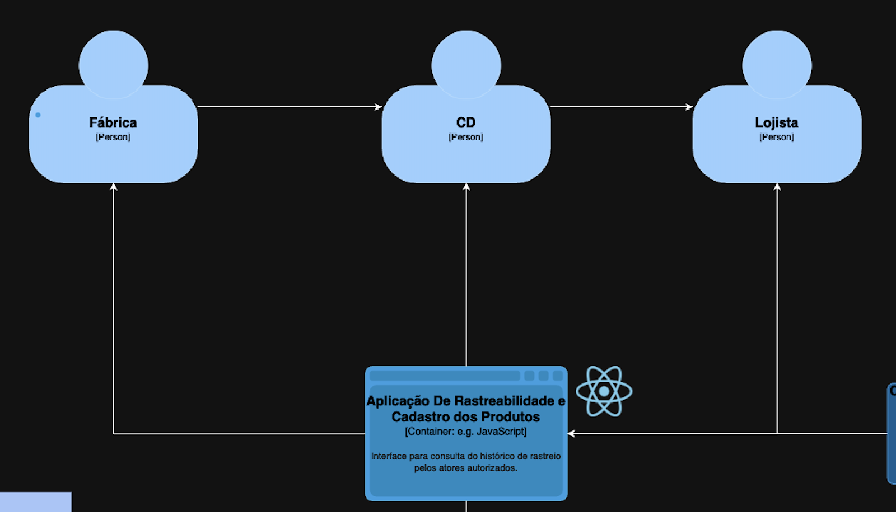
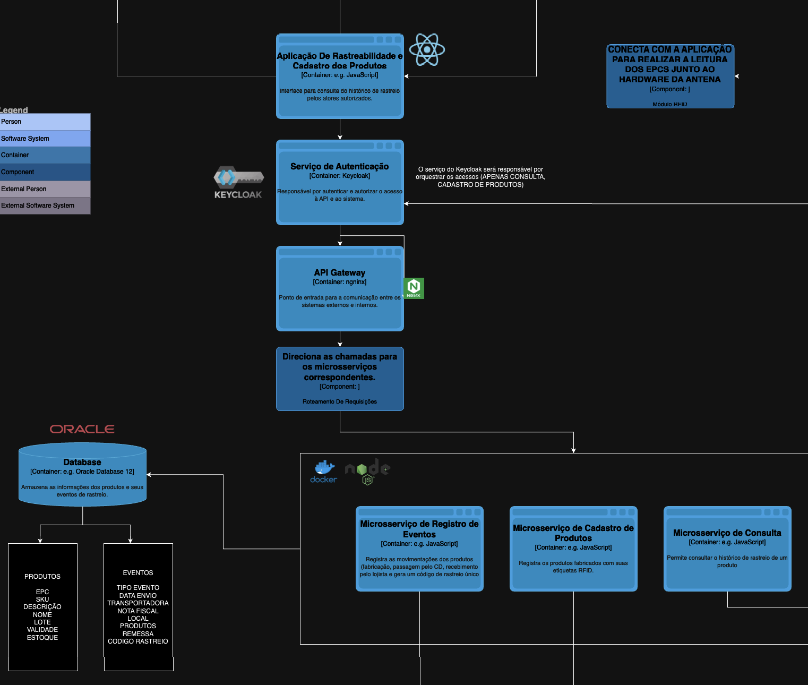
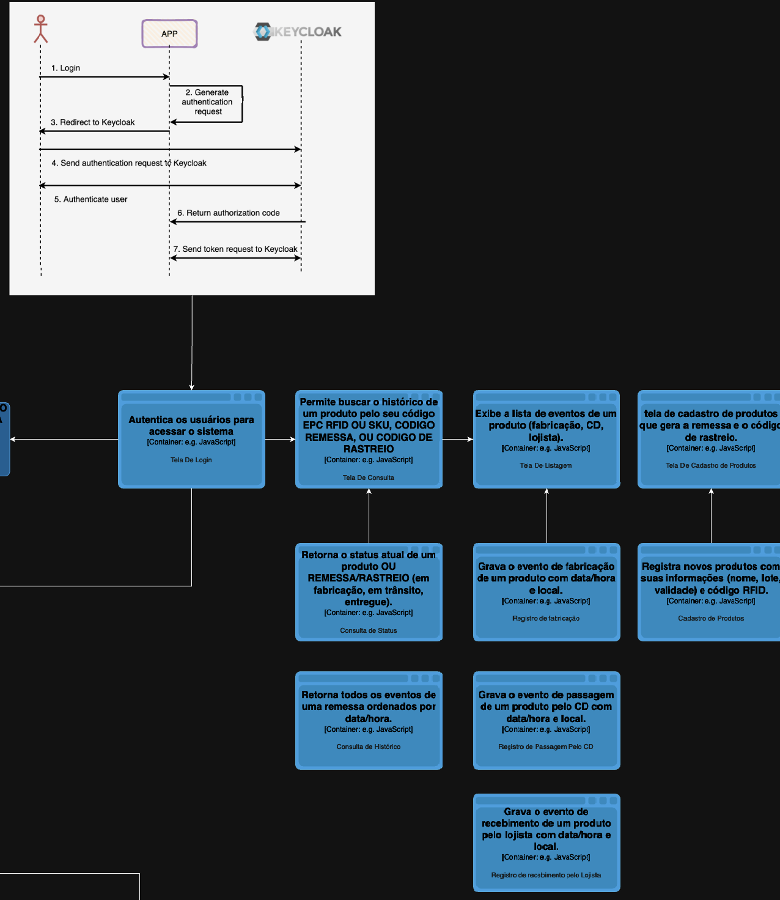
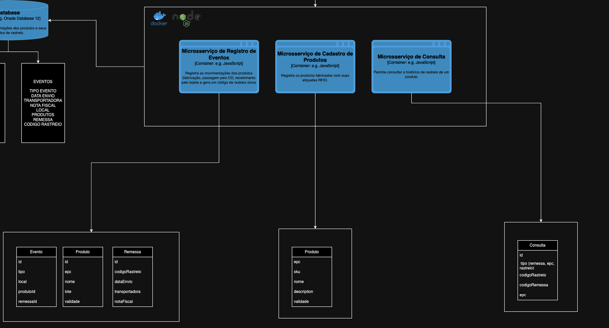
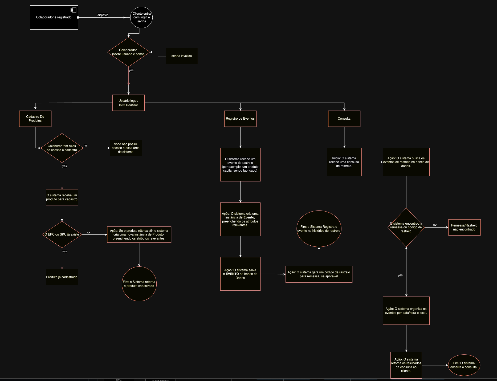

# Arquitetura do Sistema de Rastreabilidade de Produtos

## Visão Geral

Este documento descreve a arquitetura do sistema de rastreabilidade de produtos, que permite monitorar os produtos desde a fábrica até o lojista, utilizando etiquetas RFID. A arquitetura é composta por microsserviços, cada um responsável por uma funcionalidade específica, e é gerenciada por um API Gateway.

## Diagrama

## Estrutura

### Contexto (Nível 1)

- **Sistema de Rastreabilidade de Produtos**: Centraliza o monitoramento dos produtos.
- **Atores**: Fábrica, Centro de Distribuição (CD), Lojista.

### Container (Nível 2)

- **Aplicação Web/Mobile**: Interface para consulta do histórico de rastreio.
- **API Gateway**: Ponto de entrada para comunicação entre sistemas.
- **Serviço de Autenticação (Keycloak)**: Gerencia a autenticação e autorização.
- **Microsserviço de Cadastro de Produtos**: Registra produtos com etiquetas RFID.
- **Microsserviço de Registro de Eventos**: Registra movimentações dos produtos.
- **Microsserviço de Consulta**: Permite consultar o histórico de rastreio.

### Componente (Nível 3)

- **Frontend**: Interface do usuário para consulta de histórico de rastreio.
- **Backend**: API Gateway e microsserviços.

### Código (Nível 4)

- **Frontend**: Desenvolvido em React.
- **Backend**: Desenvolvido em Node.js, Express.
- **Microsserviço de Cadastro de Produtos**: Registra produtos com etiquetas RFID.
- **Microsserviço de Registro de Eventos**: Registra movimentações dos produtos.
- **Microsserviço de Consulta**: Permite consultar o histórico de rastreio.

## Diagrama UML

## Rotas e Serviços

- **Rotas**:

  - `/produtos`: Cadastro de produtos.
  - `/eventos`: Registro de eventos.
  - `/consulta`: Consulta de histórico de rastreio.

- **Serviços**:
  - **Cadastro de Produtos**: Registra produtos com etiquetas RFID.
  - **Registro de Eventos**: Registra movimentações dos produtos.
  - **Consulta**: Permite consultar o histórico de rastreio.

## Tecnologia

- **Frontend**: React.
- **Backend**: Node.js, Express.
- **Autenticação**: Keycloak.
- **Banco de Dados**: PostgreSQL, MySQL, MongoDB, DynamoDB.
- **Infraestrutura**: Kubernetes, Docker, AWS, Serverless.

## Modelo de Autenticação

- **Keycloak**: Utilizado para autenticação e autorização dos usuários. Suporta SSO (Single Sign-On) e RBAC (Role-Based Access Control).

## Canais de Acesso

- **Canais Abertos para Todo o Público**:
  - Consulta de histórico de rastreio (com restrições de acesso baseadas em permissões).
- **Canais Restritos**:
  - Cadastro de produtos (apenas para atores autorizados).
  - Registro de eventos (apenas para atores autorizados).

## Considerações Finais

A arquitetura proposta visa garantir a rastreabilidade dos produtos de forma eficiente e segura, permitindo o monitoramento em tempo real de toda a cadeia de suprimentos. A utilização de microsserviços e um API Gateway facilita a escalabilidade e manutenção do sistema, enquanto o Keycloak garante a segurança das informações e o controle de acesso dos usuários.
